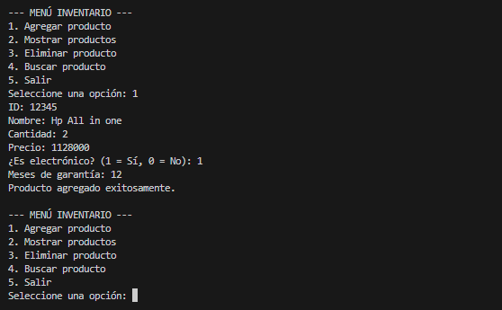
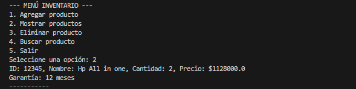

## Sistema de Gestión de Inventario en Java: StockManager🧮
______________________________________
## Integrantes
```ruby
  ________________________________________
--👤 GABRIEL ALEJANDRO ORTIZ 192474: Diseñador de Clases y Modelo de Datos
  ________________________________________
--👤 EYLEEN ROXANNE PEREZ 192461: Lógica de Inventario y Gestión de Datos
  ________________________________________
--👤 DAIRO CAMILO ANGARITA 192475: Interfaz de Usuario y Validaciones
_______________________________________

## 🧠Descripción del problema y solución propuesta**

# 📝 Descripción del problema
En muchos entornos, especialmente en pequeñas empresas, escuelas o almacenes, la gestión del inventario de productos se realiza de forma manual, usando papel, hojas de cálculo o métodos desorganizados.
Esto puede provocar varios problemas como:

📍Pérdida de información.
📍Duplicación de datos.
📍Errores en cantidades o precios.
📍Dificultad para buscar productos rápidamente.
📍Imposibilidad de filtrar por categorías como electrónicos u otros tipos.
📍Además, al no tener una estructura clara, se vuelve complicado escalar o modificar el sistema.

# 💡 Solución propuesta
Se propone una aplicación de consola desarrollada en Java, basada en programación orientada a objetos, que permita gestionar un inventario básico de productos de forma simple y efectiva.
📍Gestión CRUD (Crear, Leer, Eliminar, Buscar) de productos.
📍Diferenciación entre productos generales y productos electrónicos mediante herencia.
📍Validación de entradas con manejo de errores (try-catch) para evitar fallos por entradas incorrectas.
📍Uso de clases separadas y bien estructuradas para lograr un código modular, mantenible y escalable.
📍Interfaz por consola con menú interactivo y navegación amigable.
_______________________________________
```
## 🧱Explicación de clases y métodos principales
```ruby
📄 Producto.java
Clase base que representa cualquier tipo de producto en el sistema.
Atributos: 
int id – Identificador único del producto.
String nombre – Nombre del producto.
int cantidad – Cantidad disponible.
double precio – Precio unitario.

Métodos clave:
Producto(...) – Constructor para inicializar los atributos.

getId() – Devuelve el ID del producto.
mostrarInformacion() – Imprime los datos del producto por consola.
`Se diseñó como clase genérica para permitir extensiones mediante herencia.`
    _______________________________________
📄 Electronico.java
`Subclase de Producto que añade un atributo específico: la garantía.`
Atributos adicionales:
int garantia – Meses de garantía del producto electrónico.

Métodos clave:
Electronico(...) – Constructor que hereda de Producto y añade garantía.
mostrarInformacion() – Sobrescribe el método padre para incluir garantía.
`Permite extender fácilmente el inventario con productos especializados sin duplicar lógica.`
    _______________________________________
📄 Inventario.java
Clase encargada de manejar la colección de productos y ejecutar operaciones CRUD.

Atributos:
Producto[] productos – Arreglo de hasta 100 productos.
int contador – Lleva la cuenta de productos registrados.

Métodos clave:
agregarProducto(Producto producto) – Añade un nuevo producto.
mostrarProductos() – Muestra todos los productos.
eliminarProducto(int id) – Elimina un producto por su ID.
buscarProducto(int id) – Busca y muestra un producto por su ID.
`Representa la lógica central del inventario. Usa polimorfismo para manejar productos de distintas clases de forma uniforme.`
    _______________________________________
📄 Utilidades.java
`Clase auxiliar para entrada de datos desde consola con validación.`

Métodos clave:
leerEntero(String mensaje) – Lee un número entero y valida entrada.
leerDouble(String mensaje) – Lee un número decimal con validación.
leerCadena(String mensaje) – Lee una cadena de texto.

`Mejora la experiencia del usuario y evita errores comunes como ingresar letras en lugar de números.`
    _______________________________________
📄 Main.java
`Clase principal del sistema. Maneja el menú interactivo con el usuario.`

Lógica:
Usa un bucle do-while para mostrar el menú.
Lee opciones con Utilidades.
Ejecuta funciones de Inventario según la opción seleccionada.

Opciones disponibles:

🔻Agregar producto (normal o electrónico).
🔻Mostrar productos.
🔻Eliminar producto.
🔻Buscar producto.
🔻Salir del sistema.
`Orquesta la interacción entre clases. Es el punto de entrada del sistema.`
_______________________________________
```
## ▶️ Instrucciones básicas para ejecutar el programa
```ruby
✅ 1. Requisitos previos
`Asegúrate de tener instalado:`
    🔹Java Development Kit (JDK) versión 8 o superior.
    🔹Un editor de texto o IDE (opcional): IntelliJ, VS Code, Eclipse, etc.
    🔹Consola o terminal.

🛠 2. Archivos necesarios
`Asegúrate de tener los siguientes archivos en la misma carpeta:`
    Main.java
    Producto.java
    Electronico.java
    Inventario.java
    Utilidades.java

▶️ 4. Ejecución
Ejecutar desde el archivo main.java y darle al Run
public class Main {
    Run|Debug
    public static void main(String[] args) {
        Inventario inventario = new Inventario(100);
        int opcion;

Verás en consola un menú interactivo donde podrás:
--- MENÚ INVENTARIO ---
1. Agregar producto
2. Mostrar productos
3. Eliminar producto
4. Buscar producto
5. Salir
Seleccione una opción:
_______________________________________
```
## 🎞️Capturas de pantalla o ejemplos de uso (opcional):

